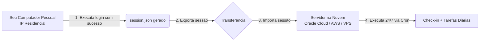

# Guia Avançado: Execução em Servidores na Nuvem e Gestão de Sessões

Este guia explica detalhadamente o funcionamento dos mecanismos de segurança do AliExpress em ambientes de nuvem (Oracle Cloud, AWS, Google Cloud, DigitalOcean, Hetzner, etc.) e o método recomendado de **delegação de sessão** (geração local e exportação para o servidor).

---

## Sumário

1. [O Desafio de IPs de Datacenter (Anti-Bot Baxia)](#1-o-desafio-de-ips-de-datacenter-anti-bot-baxia)
2. [Por que a Autenticação Funciona no PC e Falha na Nuvem?](#2-por-que-a-autenticação-funciona-no-pc-e-falha-na-nuvem)
3. [A Solução: Delegação de Sessão (Gerar Local -> Exportar para Nuvem)](#3-a-solução-delegação-de-sessão-gerar-local---exportar-para-nuvem)
4. [Métodos para Transferir a Sessão](#4-métodos-para-transferir-a-sessão)
   - [Método 1: Utilitários Automáticos (`export_session.js` e `import_session.js`)](#método-1-utilitários-automáticos-export_sessionjs-e-import_sessionjs)
   - [Método 2: Transferência Direta via SCP](#método-2-transferência-direta-via-scp)
   - [Método 3: Criação Direta via Terminal (Here-Doc)](#método-3-criação-direta-via-terminal-here-doc)
5. [Duração e Renovação da Sessão](#5-duração-e-renovação-da-sessão)
6. [Troca de Contas na Nuvem](#6-troca-de-contas-na-nuvem)
7. [Otimizações para VPS com Pouca Memória (512 MB - 1 GB RAM)](#7-otimizações-para-vps-com-pouca-memória-512-mb---1-gb-ram)
8. [Agendamento no Cron com Notificações no Telegram](#8-agendamento-no-cron-com-notificações-no-telegram)
9. [Rotação Periódica de Segredos e Pruning de Backups](#9-rotação-periódica-de-segredos-e-pruning-de-backups)
10. [Monitorar se o Cron Morreu (Dead Man's Switch / Heartbeat)](#10-monitorar-se-o-cron-morreu-dead-mans-switch--heartbeat)
11. [Higiene e Rotação de Logs do Cron (logrotate)](#11-higiene-e-rotação-de-logs-do-cron-logrotate)

---

## 1. O Desafio de IPs de Datacenter (Anti-Bot Baxia)

O AliExpress (Grupo Alibaba) emprega um sistema corporativo de controle de risco e proteção anti-automação chamado **Baxia**. Esse sistema avalia a pontuação de reputação de cada conexão:

- **Faixas de IP de Datacenter:** Servidores em nuvem como Oracle Cloud, AWS EC2, DigitalOcean ou Linode possuem blocos ASN públicos catalogados como datacenters/hospedagem.
- **Detecção de Novo Login:** Quando um formulário de login (usuário e senha) é submetido a partir de um IP de nuvem em modo headless (sem interface gráfica), o Baxia interrompe o fluxo exigindo:
  1. **Slide Captcha de Alta Resolução:** Um controle deslizante com verificação de telemetria de mouse, aceleração e entropia humana.
  2. **Verificação em Duas Etapas (2FA):** Envio de código de 6 dígitos para o e-mail ou SMS cadastrado na conta.

Se esses desafios não forem resolvidos, o AliExpress não emite o cookie mestre de autenticação (`xman_us_t`). Como consequência:

- O check-in não identifica a conta (`0 moedas`, sequência `N/D`).
- O painel de tarefas ("Ganhe mais moedas") não carrega nem abre a gaveta.

> [!IMPORTANT]
> **Detecção Automática de Falha de Login:**
> Se o script não conseguir obter simultaneamente a sequência de dias (_streak_), as moedas do check-in diário e o saldo total da conta, ele alerta explicitamente `[ERRO AO EFETUAR O LOGIN]`, purga a sessão inválida e interrompe a rotina imediatamente para evitar execuções com dados zerados ou travamentos no painel de tarefas.

---

## 2. Por que a Autenticação Funciona no PC e Falha na Nuvem?

1. **IPs Residenciais:** A sua conexão de internet residencial (provedores comuns de banda larga) possui alta reputação. O AliExpress raramente desafia o envio de credenciais feito a partir de computadores pessoais.
2. **Reutilização de Cookies:** O AliExpress **não bloqueia** o acesso à central de moedas por IP de datacenter se a requisição já contiver uma sessão previamente autenticada (cookies `xman_us_t`, `aep_usuc_f`, etc.).
3. **Conclusão:** Basta efetuar o login uma única vez no seu computador pessoal e transferir os arquivos de sessão gerados para o seu servidor na nuvem.

---

## 3. A Solução: Delegação de Sessão (Gerar Local -> Exportar para Nuvem)

O fluxo de trabalho ideal para manter a automação rodando 24/7 na nuvem é:



1. **No computador pessoal:** Execute o script normalmente (`./run_all.sh` no Linux/macOS ou `run_all.bat` no Windows). A sessão será autenticada e salva em `session.json`.
2. **Transferência:** Envie os arquivos de sessão para a pasta `ali-coins` do seu servidor na nuvem.
3. **No servidor na nuvem:** Execute `./run_all.sh`. O script detectará a sessão válida, fará o handshake de cookies e rodará diariamente sem nunca pedir senha nem disparar captchas.

---

## 4. Métodos para Transferir a Sessão

### Método 1: Utilitários Automáticos (`export_session.js` e `import_session.js`)

O projeto inclui scripts dedicados para exportação e importação de sessão criptografada com **AES-256-GCM** (usando `scrypt` para derivação de chave e tag de autenticação):

1. **No seu computador pessoal (onde o login foi realizado):**
   Defina a variável `SESSION_SECRET` (mínimo de 32 caracteres) e exporte a sessão:

   ```bash
   export SESSION_SECRET="sua_chave_ultra_secreta_com_mais_de_32_caracteres"
   node export_session.js
   ```

   O script gerará um token criptografado (formato `v1:iv:tag:ciphertext:base64`), salvando-o com permissão restrita `0o600` em `session_token.txt`. Por segurança contra vazamento em telas e logs, o terminal exibirá apenas o fingerprint SHA-256 e o tamanho do arquivo. (Caso precise exibir o token completo na tela, adicione a flag `--show-token`).

2. **No terminal do servidor na nuvem (dentro de `~/ali-coins`):**
   Transfira o arquivo `session_token.txt` ou envie seu conteúdo via STDIN:
   ```bash
   export SESSION_SECRET="sua_chave_ultra_secreta_com_mais_de_32_caracteres"
   node import_session.js < session_token.txt
   # ou via argumento de arquivo:
   node import_session.js --from-file=session_token.txt
   ```
   > 🔒 **Importante:** O script recusa tokens diretamente em `process.argv` para impedir vazamento de credenciais no histórico do shell (`~/.bash_history`) ou na listagem do `ps aux`. A memória do token é zerada logo após a descriptografia. O utilitário valida a estrutura via schema `zod`, cria o `session.json` e o `session_meta.json` com permissão `0o600` e confirma a prontidão do ambiente.

---

### Método 2: Transferência Direta via SCP

Caso você tenha acesso SSH configurado do seu computador para o servidor:

1. No terminal do seu computador pessoal, dentro da pasta `ali-coins`:
   ```bash
   scp session.json session_meta.json ubuntu@<IP_DO_SERVIDOR>:~/ali-coins/
   ```
   _(Substitua `ubuntu` e `<IP_DO_SERVIDOR>` pelos dados de acesso da sua máquina virtual)._

---

### Método 3: Criação Direta via Terminal (Here-Doc)

Se preferir não usar tokens nem SCP, você pode colar os arquivos diretamente no terminal SSH da nuvem usando `cat << 'EOF'`:

1. No terminal da nuvem:

   ```bash
   cat << 'EOF' > session_meta.json
   {
     "user": "seu_email@gmail.com",
     "savedAt": "2026-09-10T11:00:00.000Z"
   }
   EOF
   ```

2. Abra o `session.json` gerado na sua máquina local com um editor de texto, copie seu conteúdo e cole no servidor:
   ```bash
   cat << 'EOF' > session.json
   { ... cole aqui o conteudo do session.json local ... }
   EOF
   ```

---

## 5. Duração e Renovação da Sessão

- **Validade dos Cookies:** Os cookies de sessão do AliExpress (`xman_us_t`, `aep_usuc_f`, `xman_t`) possuem validade que varia de **30 a 90 dias**.
- **Renovação Automática:** Cada vez que o script roda diariamente pelo Cron, o AliExpress renova automaticamente o prazo de expiração dos cookies ativos.
- **Quando será necessário refazer o procedimento?** Apenas se você alterar a senha da conta no AliExpress ou se deslogar explicitamente de todas as sessões nas configurações de segurança do site.

> [!WARNING]
> **Detecção e Alerta de Sessão Importada Expirada:**
> Caso a sessão em execução no servidor remoto expire ou seja invalidada pelo AliExpress, a aplicação detecta automaticamente que ela foi recebida de outro host (`node import_session.js`). O sistema registra um aviso claro nos logs e envia um alerta detalhado via bot do Telegram sugerindo a renovação:
>
> 1. Execute `node export_session.js` na máquina de origem.
> 2. Importe o token atualizado no servidor remoto com `node import_session.js < session_token.txt`.

---

## 6. Troca de Contas na Nuvem

Se você decidir alterar o usuário no `credentials.env` do servidor:

1. Altere o `credentials.env` também na sua máquina local.
2. Execute o `./run_all.sh` na máquina local para gerar a nova sessão da nova conta.
3. Exporte a nova sessão para o servidor usando `node export_session.js` e `node import_session.js`.

> [!IMPORTANT]
> O script possui proteção integrada: se o usuário configurado no `credentials.env` for diferente do usuário registrado na sessão ativa (`session_meta.json`), o script avisará que a conta mudou e exigirá a nova sessão correspondente para evitar coletar moedas na conta errada.

---

## 7. Otimizações para VPS com Pouca Memória (512 MB - 1 GB RAM)

Em instâncias gratuitas da Oracle Cloud ou servidores VPS compactos com 1 GB de RAM, o navegador Chromium do Playwright pode ser encerrado pelo sistema operacional (_OOM Killer_) se a memória livre for insuficiente durante o carregamento de páginas com muitos anúncios ou produtos.

Para evitar falhas por memória:

1. **Crie um arquivo de memória Swap de 2 GB:**

   ```bash
   sudo fallocate -l 2G /swapfile
   sudo chmod 600 /swapfile
   sudo mkswap /swapfile
   sudo swapon /swapfile
   echo '/swapfile none swap sw 0 0' | sudo tee -a /etc/fstab
   ```

2. **Verifique se a Swap está ativa:**
   ```bash
   free -h
   ```
   A linha `Swap:` deve indicar aproximadamente `2.0Gi` disponível.

---

## 8. Agendamento no Cron com Notificações no Telegram

Para manter a coleta 100% autônoma no servidor na nuvem, adicione uma entrada no `crontab` do usuário:

```bash
crontab -e
```

Adicione a linha para execução diária (exemplo: todos os dias às 04:15 da manhã):

```bash
# Executa diariamente às 04:15 da manhã com notificação no Telegram
15 4 * * * cd /home/ubuntu/ali-coins && /usr/bin/node all.js >> /home/ubuntu/ali-coins/cron.log 2>&1
```

> [!TIP]
>
> - Se você configurou `TELEGRAM_ENABLED=true` no `credentials.env`, a notificação será enviada automaticamente em cada execução (sucesso, já coletado ou eventual erro).
> - Para não ser acordado de madrugada, ative `TELEGRAM_SILENT=true` no `credentials.env` para que as mensagens cheguem sem alerta sonoro.
> - Caso queira desativar notificações especificamente no cron, adicione a flag `--no-notify`.
> - **Atenção à inicialização:** Certifique-se de ter iniciado a conversa com o seu bot enviando `/start` antes da primeira execução, pois a API do Telegram não autoriza bots a iniciarem conversas com usuários.
> - Consulte [**`TELEGRAM.md`**](TELEGRAM.md) para o guia detalhado de criação do bot e resolução de dúvidas.

---

## 9. Rotação Periódica de Segredos e Pruning de Backups

Para conformidade com boas práticas de segurança em servidores na nuvem, recomenda-se rotacionar periodicamente as chaves de criptografia at-rest (`session.json.enc`):

### 1. Rotação Mensal via Cron

Você pode agendar a rotação de chave de sessão no `crontab` (por exemplo, no primeiro dia de cada mês às 03:00 da manhã):

```bash
# Rotação mensal agendada no dia 1 de cada mês às 03:00
0 3 1 * * cd /home/ubuntu/ali-coins && /usr/bin/node export_session.js --rotate --new-secret-from-env=SESSION_SECRET_NEW >> /home/ubuntu/ali-coins/rotation.log 2>&1
```

### 2. Backups e Retenção Automática (Pruning)

- A cada rotação, um backup cifrado da sessão anterior é gravado em `scratch/session.bak-<timestamp>.json.enc` com permissão estrita `0o600`.
- O mecanismo de **prune automático** descarta backups com mais de 7 dias de retenção (configurável através de `BACKUP_RETENTION_DAYS`), evitando acúmulo de arquivos residuais no disco da VPS.

---

## 10. Monitorar se o Cron Morreu (Dead Man's Switch / Heartbeat)

Se a sua VPS for reiniciada, faltar energia no datacenter, a interface de rede travar ou o serviço `cron` for desativado acidentalmente, **nenhum script será executado** e, consequentemente, **nenhuma mensagem de erro ou Telegram será enviada** (falha silenciosa).

Para prevenir a perda irreversível de sequência (_streak_) por inatividade silenciosa, o projeto conta com integração nativa com serviços de **Dead Man's Switch** (como [Healthchecks.io](https://healthchecks.io) ou monitores Push do [Uptime Kuma](https://github.com/louislam/uptime-kuma)).

### Como Funciona

1. **Início do Job (`/start`):** O script envia uma requisição informando que a execução iniciou.
2. **Conclusão com Sucesso:** Envia sinal de sucesso com o relatório estruturado anexado.
3. **Falha (`/fail`):** Envia sinal de falha com detalhes do erro (sem alterar o código de saída original do processo).
4. **Alerta por Ausência de Ping:** Se o serviço externo não receber nenhum ping dentro da janela esperada (ex: 24h + 1h de tolerância), ele enviará um alerta direto para você (via E-mail, Telegram, Discord, Pushover ou SMS).

### Passo a Passo de Configuração

1. Crie uma conta gratuita em [healthchecks.io](https://healthchecks.io) (ou acesse sua instância do Uptime Kuma).
2. Crie um novo check com os parâmetros recomendados:
   - **Period (Período):** `24 hours`
   - **Grace Time (Tolerância):** `1 hour`
   - _(Resultado: você será alertado se passarem ~25 horas sem que o job execute)._
3. Copie a URL única gerada (exemplo: `https://hc-ping.com/seu-uuid-aqui`).
4. Configure no arquivo `credentials.env` do servidor:
   ```env
   HEARTBEAT_URL="https://hc-ping.com/seu-uuid-aqui"
   HEARTBEAT_TIMEOUT_MS=5000
   ```
5. _(Opcional)_ No CLI, você pode controlar o envio usando as flags `--heartbeat` ou `--no-heartbeat`:
   ```bash
   npm start -- --heartbeat
   npm start -- --no-heartbeat
   ```

### Validação (Dry-Run vs Execução Real)

- **Modo Dry-Run (`npm start -- --dry-run`):** Apenas valida sintaxe e conectividade teórica sem disparar requisições para o monitor.
- **Execução Real com Heartbeat:**
  ```bash
  ./run_all.sh
  ```
  O log registrará: `heartbeat: ok` com o token mascarado (ex: `https://hc-ping.com/a1b2***7890/start`), sem expor credenciais.

### Resolução de Problemas (Troubleshooting)

- **Alerta de Check Falhando / Down:**
  - Verifique se a VPS tem acesso à internet executando: `curl -I https://hc-ping.com`.
  - Verifique se as portas de saída `443` (HTTPS) estão liberadas na política de firewall da nuvem (Security Lists / Security Groups).
  - Confirme se o serviço `cron` do Linux está rodando com `systemctl status cron` (ou `crond`).
- **Uso de HTTP:** Sempre utilize `https://` para garantir que o UUID do seu monitor trafegue criptografado.

---

## 11. Higiene e Rotação de Logs do Cron (logrotate)

Ao agendar a execução periódica com redirecionamento de logs (por exemplo: `0 8 * * * cd /caminho/ali-coins && ./run_all.sh >> cron.log 2>&1`), o arquivo `cron.log` acumulará saídas ao longo do tempo.

Para evitar crescimento descontrolado do disco sem alterar o comportamento de logging da aplicação, recomenda-se configurar o utilitário nativo de sistema **`logrotate`** com a diretiva `copytruncate`.

> [!NOTE]
> O `copytruncate` é fundamental para scripts agendados via shell redirect (`>>`), pois permite que o processo continue escrevendo no arquivo sem perda de ponteiro ou travamentos de descritor (`file descriptor`).

### Arquivo de Configuração Recomendado

Exemplo de configuração para manter até 4 semanas de logs com rotação semanal e compressão gzip:

```text
/home/seu_usuario/ali-coins/*.log {
    weekly
    rotate 4
    compress
    delaycompress
    missingok
    notifempty
    copytruncate
}
```

### Passo a Passo de Instalação (Linux)

1. Crie o arquivo de definição em `/etc/logrotate.d/ali-coins` (substituindo pelo caminho absoluto obtido com `pwd`):

   ```bash
   sudo tee /etc/logrotate.d/ali-coins << 'EOF'
   /home/seu_usuario/ali-coins/*.log {
       weekly
       rotate 4
       compress
       delaycompress
       missingok
       notifempty
       copytruncate
   }
   EOF
   ```

2. Ajuste as permissões do arquivo de configuração:

   ```bash
   sudo chmod 644 /etc/logrotate.d/ali-coins
   ```

3. Valide a sintaxe e teste a execução em modo de simulação (dry-run):
   ```bash
   sudo logrotate -d /etc/logrotate.d/ali-coins
   ```

O sistema Linux executará a rotação automaticamente no cron diário (`/etc/cron.daily/logrotate`), mantendo o consumo de disco controlado e previsível.

---

[Voltar para o README Principal](README.md)
