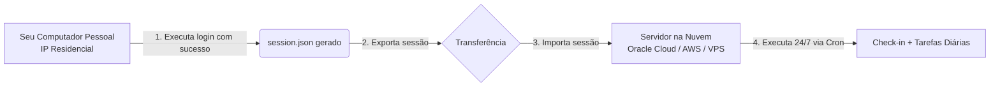

# Guia Avançado: Execução em Servidores na Nuvem e Gestão de Sessões

Este guia explica detalhadamente o funcionamento dos mecanismos de segurança do AliExpress em ambientes de nuvem (Oracle Cloud, AWS, Google Cloud, DigitalOcean, Hetzner, etc.) e o método recomendado de **delegação de sessão** (geração local e exportação para o servidor).

---

## Sumário
1. [O Desafio de IPs de Datacenter (Anti-Bot Baxia)](#1-o-desafio-de-ips-de-datacenter-anti-bot-baxia)
2. [Por que a Autenticação Funciona no PC e Falha na Nuvem?](#2-por-que-a-autenticação-funciona-no-pc-e-falha-na-nuvem)
3. [A Solução: Delegação de Sessão (Gerar Local -> Exportar para Nuvem)](#3-a-solução-delegação-de-sessão-gerar-local---exportar-para-nuvem)
4. [Métodos para Transferir a Sessão](#4-métodos-para-transferir-a-sessão)
   - [Método 1: Utilitários Automáticos (`export_session.js` e `import_session.js`)](#método-1-utilitários-automáticos-export_sessionjs-e-import_sessionjs)
   - [Método 2: Transferência Direta via SCP](#método-2-transferência-direta-via-scp)
   - [Método 3: Criação Direta via Terminal (Here-Doc)](#método-3-criação-direta-via-terminal-here-doc)
5. [Duração e Renovação da Sessão](#5-duração-e-renovação-da-sessão)
6. [Troca de Contas na Nuvem](#6-troca-de-contas-na-nuvem)
7. [Otimizações para VPS com Pouca Memória (512 MB - 1 GB RAM)](#7-otimizações-para-vps-com-pouca-memória-512-mb---1-gb-ram)

---

## 1. O Desafio de IPs de Datacenter (Anti-Bot Baxia)

O AliExpress (Grupo Alibaba) emprega um sistema corporativo de controle de risco e proteção anti-automação chamado **Baxia**. Esse sistema avalia a pontuação de reputação de cada conexão:

- **Faixas de IP de Datacenter:** Servidores em nuvem como Oracle Cloud, AWS EC2, DigitalOcean ou Linode possuem blocos ASN públicos catalogados como datacenters/hospedagem.
- **Detecção de Novo Login:** Quando um formulário de login (usuário e senha) é submetido a partir de um IP de nuvem em modo headless (sem interface gráfica), o Baxia interrompe o fluxo exigindo:
  1. **Slide Captcha de Alta Resolução:** Um controle deslizante com verificação de telemetria de mouse, aceleração e entropia humana.
  2. **Verificação em Duas Etapas (2FA):** Envio de código de 6 dígitos para o e-mail ou SMS cadastrado na conta.

Se esses desafios não forem resolvidos, o AliExpress não emite o cookie mestre de autenticação (`xman_us_t`). Como consequência:
- O check-in não identifica a conta (`0 moedas`, sequência `N/D`).
- O painel de tarefas ("Ganhe mais moedas") não carrega nem abre a gaveta.

> [!IMPORTANT]
> **Detecção Automática de Falha de Login:**
> Se o script não conseguir obter simultaneamente a sequência de dias (*streak*), as moedas do check-in diário e o saldo total da conta, ele alerta explicitamente `[ERRO AO EFETUAR O LOGIN]`, purga a sessão inválida e interrompe a rotina imediatamente para evitar execuções com dados zerados ou travamentos no painel de tarefas.

---

## 2. Por que a Autenticação Funciona no PC e Falha na Nuvem?

1. **IPs Residenciais:** A sua conexão de internet residencial (provedores comuns de banda larga) possui alta reputação. O AliExpress raramente desafia o envio de credenciais feito a partir de computadores pessoais.
2. **Reutilização de Cookies:** O AliExpress **não bloqueia** o acesso à central de moedas por IP de datacenter se a requisição já contiver uma sessão previamente autenticada (cookies `xman_us_t`, `aep_usuc_f`, etc.).
3. **Conclusão:** Basta efetuar o login uma única vez no seu computador pessoal e transferir os arquivos de sessão gerados para o seu servidor na nuvem.

---

## 3. A Solução: Delegação de Sessão (Gerar Local -> Exportar para Nuvem)

O fluxo de trabalho ideal para manter a automação rodando 24/7 na nuvem é:



1. **No computador pessoal:** Execute o script normalmente (`./run_all.sh` no Linux/macOS ou `run_all.bat` no Windows). A sessão será autenticada e salva em `session.json`.
2. **Transferência:** Envie os arquivos de sessão para a pasta `ali-coins` do seu servidor na nuvem.
3. **No servidor na nuvem:** Execute `./run_all.sh`. O script detectará a sessão válida, fará o handshake de cookies e rodará diariamente sem nunca pedir senha nem disparar captchas.

---

## 4. Métodos para Transferir a Sessão

### Método 1: Utilitários Automáticos (`export_session.js` e `import_session.js`)

O projeto inclui scripts dedicados para exportação e importação de sessão sem necessidade de configurar chaves SSH ou SCP:

1. **No seu computador pessoal (onde o login foi realizado):**
   ```bash
   node export_session.js
   ```
   O script exibirá na tela um comando formatado como:
   ```bash
   node import_session.js '<TOKEN_COMPACTO>'
   ```
   *(O token também é salvo no arquivo `session_token.txt`)*.

2. **No terminal do servidor na nuvem (dentro de `~/ali-coins`):**
   Cole e execute o comando gerado:
   ```bash
   node import_session.js '<TOKEN_COMPACTO>'
   ```
   O utilitário validará os cookies essenciais, criará o `session.json` e o `session_meta.json` e confirmará a prontidão do ambiente.

---

### Método 2: Transferência Direta via SCP

Caso você tenha acesso SSH configurado do seu computador para o servidor:

1. No terminal do seu computador pessoal, dentro da pasta `ali-coins`:
   ```bash
   scp session.json session_meta.json ubuntu@<IP_DO_SERVIDOR>:~/ali-coins/
   ```
   *(Substitua `ubuntu` e `<IP_DO_SERVIDOR>` pelos dados de acesso da sua máquina virtual).*

---

### Método 3: Criação Direta via Terminal (Here-Doc)

Se preferir não usar tokens nem SCP, você pode colar os arquivos diretamente no terminal SSH da nuvem usando `cat << 'EOF'`:

1. No terminal da nuvem:
   ```bash
   cat << 'EOF' > session_meta.json
   {
     "user": "seu_email@gmail.com",
     "savedAt": "2026-09-10T11:00:00.000Z"
   }
   EOF
   ```

2. Abra o `session.json` gerado na sua máquina local com um editor de texto, copie seu conteúdo e cole no servidor:
   ```bash
   cat << 'EOF' > session.json
   { ... cole aqui o conteudo do session.json local ... }
   EOF
   ```

---

## 5. Duração e Renovação da Sessão

- **Validade dos Cookies:** Os cookies de sessão do AliExpress (`xman_us_t`, `aep_usuc_f`, `xman_t`) possuem validade que varia de **30 a 90 dias**.
- **Renovação Automática:** Cada vez que o script roda diariamente pelo Cron, o AliExpress renova automaticamente o prazo de expiração dos cookies ativos.
- **Quando será necessário refazer o procedimento?** Apenas se você alterar a senha da conta no AliExpress ou se deslogar explicitamente de todas as sessões nas configurações de segurança do site.

---

## 6. Troca de Contas na Nuvem

Se você decidir alterar o usuário no `credentials.env` do servidor:
1. Altere o `credentials.env` também na sua máquina local.
2. Execute o `./run_all.sh` na máquina local para gerar a nova sessão da nova conta.
3. Exporte a nova sessão para o servidor usando `node export_session.js` e `node import_session.js`.

> [!IMPORTANT]
> O script possui proteção integrada: se o usuário configurado no `credentials.env` for diferente do usuário registrado na sessão ativa (`session_meta.json`), o script avisará que a conta mudou e exigirá a nova sessão correspondente para evitar coletar moedas na conta errada.

---

## 7. Otimizações para VPS com Pouca Memória (512 MB - 1 GB RAM)

Em instâncias gratuitas da Oracle Cloud ou servidores VPS compactos com 1 GB de RAM, o navegador Chromium do Playwright pode ser encerrado pelo sistema operacional (*OOM Killer*) se a memória livre for insuficiente durante o carregamento de páginas com muitos anúncios ou produtos.

Para evitar falhas por memória:

1. **Crie um arquivo de memória Swap de 2 GB:**
   ```bash
   sudo fallocate -l 2G /swapfile
   sudo chmod 600 /swapfile
   sudo mkswap /swapfile
   sudo swapon /swapfile
   echo '/swapfile none swap sw 0 0' | sudo tee -a /etc/fstab
   ```

2. **Verifique se a Swap está ativa:**
   ```bash
   free -h
   ```
   A linha `Swap:` deve indicar aproximadamente `2.0Gi` disponível.

---

[Voltar para o README Principal](README.md)
